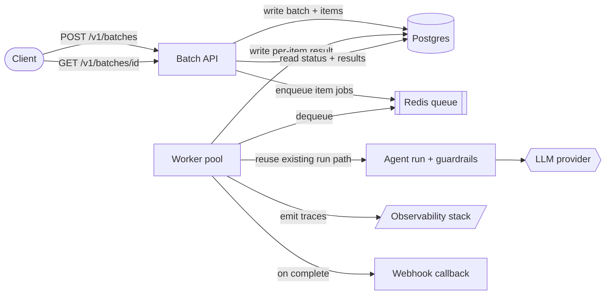

<!--
  WORKED EXAMPLE — this is system-design-template.md filled in, so you can see what "done"
  looks like. Feature: "add async batch runs" to an existing agent service. All numbers are
  ILLUSTRATIVE (made up for teaching) — they are not a real product's figures. Copy the blank
  template, not this file.
-->

# Design: Async batch runs for the agent service

- **Author:** A. Engineer   **Date:** 2025-02-10   **Status:** In review
- **Reviewers:** Platform team, Security   **Related docs:** PRD-217, ticket AGENT-1043

> The agent service today only runs one request at a time, synchronously, with a 30 s HTTP
> timeout. Customers want to submit thousands of documents at once and collect results later.
> This doc proposes an **asynchronous batch-run** path alongside the existing sync endpoint.

---

## 1. Problem & goals

- **Problem:** Power users (ops teams) need to process 1k–50k items in one job — far past what a
  single 30 s synchronous HTTP call can do. Today they hand-roll their own loops, hammer the
  sync endpoint, hit rate limits, and lose work when a request dies mid-flight.
- **Goals:**
  - Submit a batch of N items in one call; poll or get notified when it's done.
  - Survive partial failure — one bad item must not fail the whole batch.
  - Stay within a predictable token-cost ceiling per batch.
- **Non-goals:**
  - Not changing the existing synchronous endpoint (it stays for interactive use).
  - Not building a general-purpose workflow engine — this is batch agent runs, nothing more.
  - Not real-time streaming of per-item results (poll/callback is enough for v1).

## 2. Requirements

**Functional**

- `POST /v1/batches` accepts up to 50,000 items and returns a `batch_id` immediately.
- `GET /v1/batches/{id}` returns status + per-item results once complete.
- Optional webhook callback on completion.
- Per-item failures are recorded, not fatal; the batch reports `succeeded` / `failed` counts.

**Non-functional**

| Attribute | Target | Notes |
|---|---|---|
| Latency (submit) | p95 < 300 ms | submission is just an enqueue; the work is async |
| Batch completion | 10k items < 30 min | soft SLO, not a hard guarantee |
| Availability | 99.9% | for submit + status endpoints |
| Throughput | 20 items/s sustained worker pool | scales with worker count |
| Token cost / item **(AI)** | ≤ $0.008/item | enforced by a per-batch budget cap |
| Eval quality threshold **(AI)** | ≥ 0.90 pass on the batch-runner eval set | gate in CI — see [`../../eval-dataset-template/`](../../eval-dataset-template/PLAN.md) |
| Guardrails / safety **(AI)** | input injection filter + output PII scrub per item | same guards as the sync path; reused |
| Privacy / data residency | no item content to 3rd-party model beyond the existing provider | inherited constraint |
| Scale horizon | 5× item volume in 12 months | worker pool must scale horizontally |

## 3. Constraints & assumptions

- **Constraints:** Existing stack is FastAPI + Postgres + Redis; we will not add a new
  datastore for v1. Single LLM provider under contract. 12-week delivery window.
- **Assumptions:** Average item is ~2,000 tokens in + 600 out. Batches arrive bursty (a few
  large batches per day, not a steady stream). The provider's rate limit (currently 500 req/min)
  is the binding throughput constraint, not our compute.
- **Dependencies:** The shared guardrail service (injection + PII), the LLM provider, and the
  observability stack ([`../../../blueprints/observability-stack/`](../../../blueprints/observability-stack/PLAN.md)) for per-item traces.

## 4. Back-of-envelope estimation

Worked for a representative large batch and the steady-state day:

```
Traffic
  batches/day (illustrative) : ~50 batches/day, avg 10,000 items each
  items/day                  : 50 × 10,000 = 500,000 items/day
  submit QPS                 : 50 / 86,400 ≈ negligible (submission is cheap)
  worker throughput needed   : 500,000 items / (8 working-hours × 3,600 s) ≈ 17 items/s
                               → provision for 20 items/s (matches §2)
Per-item LLM cost
  tokens in / out            : 2,000 in + 600 out = 2,600 tokens/item
  blended price (illustr.)   : $2.50 / 1M tokens
  $/item                     : 2,600 / 1e6 × $2.50 = $0.0065/item   (< $0.008 cap ✓)
  $/10k batch                : 10,000 × $0.0065 = $65/batch
  $/day                      : 500,000 × $0.0065 = $3,250/day
Provider rate limit (the real bottleneck)
  limit                      : 500 req/min ≈ 8.3 req/s  → caps us BELOW the 20 items/s target
  → must request a limit raise OR run at ~8 items/s (10k items ≈ 20 min). Flagged in §7.
Storage / state
  per-item result row        : ~4 KB (input ref + output + usage + status)
  per 10k batch              : ~40 MB in Postgres; 500k/day ⇒ ~200 MB/day → partition + TTL 30d
Submit latency budget (p95 < 300 ms)
  validate + enqueue to Redis: ~50 ms ; write batch row: ~80 ms ; headroom: ~170 ms ✓
```

> **Sanity check:** cost/item ($0.0065) fits the $0.008 cap ✓. The real tension is the
> **provider rate limit** (8.3 req/s) vs the 20 items/s target — §5 resolves this with a rate-limited
> worker pool, and §7 lists "raise the limit" as a launch dependency.

## 5. Proposed architecture

A submit endpoint enqueues a batch; a pool of workers drains the queue, calling the *existing*
agent run path per item (so guardrails and evals are reused, not reimplemented).



- **Batch API** — validates, persists the batch + item rows, enqueues item jobs, returns
  `batch_id` fast. Stateless; scales behind the existing load balancer.
- **Redis queue** — the work buffer; a **token-bucket rate limiter** in front of the provider
  keeps us under the rate limit (the §4 bottleneck).
- **Worker pool** — horizontally scalable consumers; each item reuses the existing synchronous
  agent run (guardrails + structured output) so behaviour matches the sync path exactly.
- **Postgres** — batch + per-item state (status, result, token usage). Partitioned by day, 30-day TTL.

**Data flow:** (1) submit → validate → write rows → enqueue → 202 `batch_id`. (2) workers
dequeue under the rate limiter → run item → write result. (3) per-item failure → mark item
`failed`, continue. (4) last item done → mark batch `complete` → fire webhook. (5) client polls
`GET` or receives the callback.

## 6. Data model & APIs

- **Entities:**
  - `Batch` — `id`, `status` (queued|running|complete|failed), `total`, `succeeded`, `failed`,
    `token_budget`, `tokens_used`, `created_at`, `completed_at`, `webhook_url?`.
  - `BatchItem` — `id`, `batch_id`, `input_ref`, `status`, `output?`, `usage?`, `error?`, `attempts`.

- **APIs / contracts:**

```
POST /v1/batches      body: { items: [...≤50k], webhook_url?, token_budget? }  → 202 { batch_id }
GET  /v1/batches/{id}                                                          → 200 { status, counts, items[] }
POST /v1/batches/{id}/cancel                                                   → 202 { status: "cancelling" }
```

Idempotency: `POST /v1/batches` accepts an `Idempotency-Key` header so a retried submit doesn't
double-enqueue. Adding fields to the response is non-breaking; renaming/removing is a new `/v2`.

## 7. Failure modes & risks

| Failure mode | Likelihood | Blast radius | Mitigation |
|---|---|---|---|
| Provider rate-limit (429) | **high** | whole pool throttled, batches slow | token-bucket limiter sized to the limit; request a raise (launch dependency) |
| Worker crash mid-item | med | that item only | items are idempotent + at-least-once; retry with `attempts` cap (3), then mark `failed` |
| Prompt injection in item content **(AI)** | med | tool misuse / data exfil | reuse existing input guardrail per item; tool allow-list; least privilege |
| Runaway token cost on a huge batch **(AI)** | med | surprise bill | per-batch `token_budget`; pause + alert when 80% consumed; hard stop at 100% |
| Poison item stalls the queue | low | one item retries forever | retry cap + dead-letter; never block the queue head |
| Postgres growth unbounded | med | storage cost / slow queries | daily partitions + 30-day TTL; results exported before expiry |

## 8. Alternatives

- **Use the LLM provider's native Batch API** — Not chosen for v1: gives up our guardrails,
  per-item observability, and our own eval gate, and couples completion semantics to the vendor.
  Revisit if our volume makes its discount compelling. (See ADR-0007.)
- **A full workflow engine (e.g. a DAG orchestrator)** — Not chosen: far more than batch fan-out
  needs; operational weight and a new dependency we said we wouldn't add (§3). (See ADR-0007.)
- **Synchronous chunking (client loops over the sync endpoint)** — Not chosen: it's the status
  quo that causes the problem — fragile, rate-limited, loses work on disconnect.

## 9. Decision log (ADRs)

- [ADR-0007 — Build async batch on Redis + workers rather than the provider Batch API](../../../docs/adr/0007-async-batch-on-redis-workers.md)
  — chose in-house fan-out to keep guardrails, evals, and traces under our control.

> This example links one illustrative ADR. In a real repo, write it with
> [`../../adr-template/`](../../adr-template/PLAN.md) (Context · Decision · Alternatives ·
> Consequences) and commit it alongside the change.

## 10. Open questions / rollout

- **Open questions:**
  - Can we get the provider rate limit raised to 30 req/s? (Owner: Platform — blocks the 20 items/s SLO.)
  - Webhook security: signed payloads vs the client polling only for v1? (Owner: Security.)
- **Rollout plan:** Ship behind a `batch_runs` feature flag → enable for 2 internal teams →
  shadow a real workload → ramp to 10% → 100% of allow-listed customers. Rollback = flip the flag
  (sync path is untouched).
- **Launch gate:** Tick [`../../production-readiness-checklist/`](../../production-readiness-checklist/PLAN.md)
  — especially the token-cost cap, tracing on every item, and the rollback path — before GA.
- **Metrics of success:** batch completion p95 under the SLO; per-item cost ≤ $0.008; zero
  whole-batch failures from a single bad item; ops teams stop hand-rolling sync loops.
